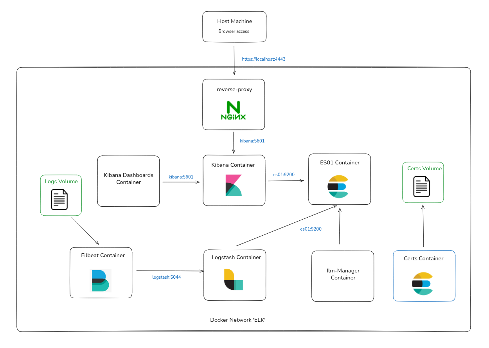

# 🕹️ Ft_transcendence

>Ft_transcendence is the final project of the 42 Common Core.
Its goal is to make us work with unfamiliar technologies (mainly web-related) and in a larger team (between 3 and 5 developers).
It requires a solid understanding of the subject, strong communication skills, and good planning and task distribution.

We used **Jira** as our project management tool and divided the work into three main areas — backend, frontend, and DevOps.
Each member also took the time to learn and experiment with technologies outside their assigned domain, to ensure complete control over the codebase and to handle potential absences within the team.

## Project Overview
*[parler de la VM]*

### Selected Modules
As we were only a team of three, we had to focus on modules that interested us but were consistent with each other and not too time-consuming.
That's why we didn't manage the server-side (CLI, API) at all, nor did we spend too much time on the graphics.
Above all, we wanted a solid backend that communicates logically with the front end, with a devops infrastructure that makes this site ready for production.

```
#### 🛠️ Web (backend/frontend)
   ├── Major: Use a framework to build the backend (Fastify + Node.js)
   ├── Minor: Use a framework to build the backend (Tailwind + TS)
   └── Minor: Use a database for the backend (SQLite)

#### 👤 User Management
   ├── Major: Standard user management, authentication and users across tour-
naments
   └── Major: Remote authentication. (Google Sign-In)

#### 🎮 Gameplay & UX
   ├── Major: Remote Players
   └── Minor: Game customization options (power-ups, map)

#### 🔐 Cybersecurity
   └── Major: Two-Factor Authentication (2FA) and JWT.

#### ⚙️ DevOps
   ├── Major: Designing the Backend as Microservices
   ├── Major: Infrastructure Setup with ELK for Log Management
   └── Minor: Monitoring system (Prometheus + Grafana)

#### 🌍 Accessibility
   └── Minor: Multiple language support
```

## Getting Started

### Prerequisites
To run the project, we need to ensure we have:
- VirtualBox or similar (for 42 campus environment)
- 8GB RAM minimum, 10GB recommended
- 20GB free disk space
> ⚠️ You cas still run it into a 42 campus env whith `make fullstack` command
- Installed [Docker](https://docs.docker.com/get-started/get-docker/)
- Installed [Docker Compose](https://docs.docker.com/compose/install/)
- Make sure our user has root privileges and be in the docker groupe:
```bash
sudo usermod -aG docker $USER
```

### Quick Start
- 1️⃣ **Clone the repo**
```bash
git clone https://github.com/Cimeci/ft_transcendence.git
cd ft_transcendence
```
- 2️⃣ **Configure env variables**
*[ad details about it]*
- 3️⃣ **Update your `/etc/hosts`**
```bash
```
- 4️⃣ **Launch the app** 
```bash
make
```


## Components
The entire project is designed as services, which are isolated, metered, and orchestrated by a docker-compose.yml file, itself managed by a Makefile (this allows for greater flexibility during the development and debugging phase). For readability, we have divided the compose into several files according to their use.

### Frontend

### Backend

### Elastic Stack
ELK stands for **E**lasticsearch, **L**ogstash, and **K**ibana - a powerful stack for centralized log management:

- **Elasticsearch**: Search and analytics engine that stores and indexes logs
- **Logstash**: Data processing pipeline that enriches and transforms logs
- **Kibana**: Visualization interface for exploring and analyzing data
- **Filebeat**: Lightweight log shipper (added to the traditional ELK stack)

This stack allows us to:
- Centralize logs from multiple services
- Search through millions of log entries in seconds
- Create real-time dashboards and alerts
- Monitor application health and performance

#### Virtual Machine environnment
As the subject specifies it itself:
> Several container technologies exist: Docker, containerd, podman, etc. On the computers of your campus, you may access the container software in rootless mode for security reasons. This could lead to the following extra constraints:
• Your runtime needs to be located in /goinfre or /sgoinfre.
• You are not able to use “bind-mount volumes” between the host and the container if non-root UIDs are used in the container. Depending on the current requirements of the subject (highlighted in green above) and the local configuration in clusters, you may need to adopt different strategies, such as: container solution in virtual machine, rebuild your container after your changes, craft your own image with root as unique UID.

We decided to build our project in a virtual machine because:
- The rootless containers on campus limit bind mounts and memory/JVM options.
- The ELK stack requires these features to function properly (and we're limited in RAM and disk space on our machines).
- The VM allows us to regain a full root environment and use Docker normally.


#### Stack and Component
The subject specifies a **ELK (ES, Logstash, Kibana)** tools are needed. But to keep the stack lightweight, we chose to use **Filebeat**, which handles log ingestion and sending them to Logstash for several reasons:
- Lighter than Logstash (low memory and CPU consumption)
- It handles offset tracking on its own (no duplicates if restarted)
- It buffers logs while waiting for Logstash to respond
- It can manage ILM policies on its own *(but we discovered that using Logstash as an intermediary for ES disables this feature)*
- Logstash only manages log enrichment and is therefore more efficient

Our stack consists of seven different containers, each with its own role, which are launched in a specific order. Each of them communicates through the `elk` Docker network:
- 1️⃣ **certs** - Temporary container that generates all SSL/TLS certificates for secure communication between components. Stops after certificate generation.
- 2️⃣ **es01** (Elasticsearch) - Exposes ports `9200` (HTTPS API) and `9300` (cluster communication) on the `elk` network only. Not exposed to the host for security.
- 3️⃣ **ilm-manager** - Temporary container that configures Index Lifecycle Management (ILM) policies in Elasticsearch. Stops after configuration.
- 4️⃣ **kibana** - Exposes port `5601` (HTTPS) on `127.0.0.1:5601` of the host, accessible only locally via browser.
- 5️⃣ **kibana-dashboards** - Temporary container that imports pre-configured dashboards into Kibana. Stops after import.
- 6️⃣ **logstash** - Exposes port `5044` (Beats input) and `9600` (HTTP monitoring API) on the `elk` network only.
- 7️⃣ **filebeat** - Reads application logs from `/var/log/app` and forwards them to Logstash on port `5044`.


*ELK Stack architecture with secure mTLS communication between components*


> **Note:** The stack runs in basic mode, so some warnings are displayed at launch (IA Assistant or AWS S3 Region). These tools are not used, so the logs can be ignored.

#### Security concern
The `elk_certs` container is built from an Elasticsearch image, which contained command [elastic-certutil](https://www.elastic.co/docs/reference/elasticsearch/command-line-tools/certutil) and allow us to create different certificate.
Each service can communicate with a mutually certification (mTLS). Each service as its own certificate, signed by the intern CA `ca.crt` (wich is a way to trust all the differents certificates).

The stack is running on a isolated network: Elasticsearch (9200) is NOT exposed to the host, only Kibana (5601) is accessible via `127.0.0.1` (localhost only) and all other communications happen within the private Docker `elk` network.

#### Template and ILM Policies
The `ilm-manager` container waits for Elasticsearch to be ready and uses the REST API to configure [Index Lifecycle Management](https://www.elastic.co/guide/en/elasticsearch/reference/current/index-lifecycle-management.html):
- Creates and applies ILM policies
- Creates index templates
- Bootstraps the first index

Our policy manages indices through four phases based on age and size:
- 🔥 **Hot Phase (Active writing)**
Creates a new index when ANY condition is met.
  - Primary shard reaches 1GB
  - Index is 7 days old
  - Index contains 1,000,000 documents.
- 🌡️ **Warm Phase (After 3 days)**
Set Index in read-only, used for recent historical data that's queried less frequently.
- ❄️**Cold Phase (After 7 days)**
Rarely accessed data, stored for compliance or historical analysis
- 🗑️ **Delete Phase (After 30 days)**
Index is permanently deleted, frees up storage space.

Also, we create an Alias `transcendence` pointing to the real current index, specified by a number, `transcendence-000001` for the exemple. That's means we got after a rollover we got:
```
transcendence (ALIAS) 
    ↓ pointing to 
transcendence-000002 (New Index, actif to the writing)
--------------------
transcendence-000001 (Old Index, read only)
```

This architecture allows:
- ✅ Seamless index rotation without downtime
- ✅ Applications always write to `transcendence` alias
- ✅ Automatic lifecycle management
- ✅ Optimized storage and performance

> **Note**: While this is somewhat overkill for an educational project like Transcendence, it demonstrates best practices for log management at scale and was a requirement of the subject.


#### Kibana Dashboards
As this stack is dedicated to a school project and cannot be maintained on a server permenently, we couldn't create dashboards from the Kiban UI and just save it. To prevent this issue, we export 3 Dashboards vues and set a kibana-dashboards container, build from an Alpine image and use the REST API to POST the ndjson dashboards.
- 1️⃣ 📊 **Application Overview** - Check our services stats (by request, attempt).
- 2️⃣ 🚨 **Errors and Security** - Monitor all `ERROR` and `FATAL` logs to keep a maintainable infra, and create a top list users make several attempts to connect.
- 3️⃣ ⚡ **Performances** - Uses the `response_time` to create performances views about our webapp.


#### Possible Improvments
As this project is built in a limited school environment with educational constraints rather than production requirements, we chose to keep a **KISS (Keep It Simple, Stupid)** workflow. However, in a production environment, we would consider:

- **Persistent Queue (Logstash)**
	- **Current**: In-memory queue only
	- **Why skipped**: No critical audit data, easy service restart, memory constraints (1GB limit)
	- **Production**: Redis or Kafka for durable queuing and replay capability

- **Secrets Management**
	- **Current**: Logstash uses keystore, other services use environment variables
	- **Why skipped**: Kibana keystore presented integration issues, Docker Compose simplicity preferred and a dedicated Vault module exists in the subject.
	- **Production**: HashiCorp Vault, Docker Swarm secrets, or Kubernetes secrets

- **Multi-node Cluster**
	- **Current**: Single-node Elasticsearch (master + data)
	- **Why skipped**: Resource constraints, added complexity
	- **Production**: Separate master and data nodes for better scalability and reliability


### Monitoring

---
### 📚 Sources

#### Backend
- [Offical JS Documentation](https://developer.mozilla.org/fr/docs/Web/JavaScript)
- [Official Fastify Documentation](https://fastify.dev/docs/latest/Reference/)
- [Fastify JWT plugin](https://www.npmjs.com/package/@fastify/jwt)
- [Fastify Better-sqlite plugin](https://www.npmjs.com/package/@powersync/better-sqlite3)

#### Frontend
- [Official TS Documenation](https://www.typescriptlang.org/)
- [Offcial Tailwind Documentation](https://tailwindcss.com/)
- [Langage Extension](https://developer.mozilla.org/fr/docs/Mozilla/Add-ons/WebExtensions/API/i18n)

#### Elastic Stack
- [Offcial ELK Doc](https://www.elastic.co/docs/solutions/search)
- [Official Docker Doc](https://docs.docker.com/reference/)
- [Official Pino Doc](https://getpino.io/#/docs/redaction)
- [Guides ELK ](https://www.elastic.co/fr/blog/author/eddie-mitchell) *[slightly outdated but still a good starting point]*
- [Repo inspiration](https://github.com/deviantony/docker-elk)

### 👥 Credits
- **Backend** Yolan [ygoget](https://github.com/goryo4)
- **Frontend** Ilan [inowak--](https://github.com/Cimeci)
- **Devops** Antoine [antauber](https://github.com/Monsieur-Bert)

📍`[42 Angouleme - October 25]`

